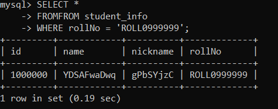
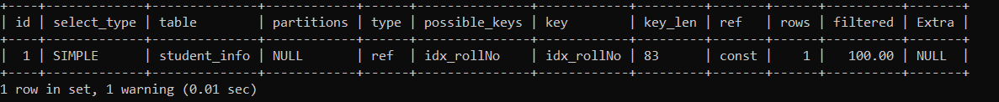
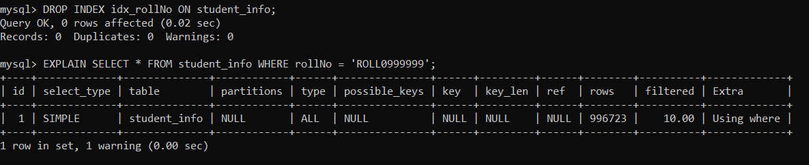

I created a new table and inserted 1 million rows into it.
 CREATE TABLE IF NOT EXISTS student_info (
        id INT AUTO_INCREMENT PRIMARY KEY,
        name VARCHAR(50),
        nickname VARCHAR(50),
        rollNo VARCHAR(20)
    );
After that I queried the database on the rollNo field without creating any index.

It took a decent amount of time.
After that i created an index on the rollNo field.

mysql> CREATE INDEX idx_rollNo ON student_info (rollNo);
Query OK, 0 rows affected (3.62 sec)
Records: 0  Duplicates: 0  Warnings: 0

And now the select statements where much faster as you can see.

mysql> SELECT * FROM student_info WHERE rollNo = 'ROLL0999999';
+---------+------------+----------+-------------+
| id      | name       | nickname | rollNo      |
+---------+------------+----------+-------------+
| 1000000 | YDSAFwaDwq | gPbSYjzC | ROLL0999999 |
+---------+------------+----------+-------------+
1 row in set (0.00 sec)

mysql> SELECT * FROM student_info WHERE rollNo = 'ROLL0999998';
+--------+------------+----------+-------------+
| id     | name       | nickname | rollNo      |
+--------+------------+----------+-------------+
| 999999 | PggaEcpwIO | qgxZbVTm | ROLL0999998 |
+--------+------------+----------+-------------+
1 row in set (0.00 sec)

We can get the query plan for our SELECT statement in MySQL by using the EXPLAIN keyword before our query.
mysql> EXPLAIN SELECT * FROM student_info WHERE rollNo = 'ROLL0999999';

So I used EXPLAIN to understand how our queries are working:

Here's an explanation of each column:

id: 1

This indicates the order in which the SELECT statements are executed. In this case, there's only one SELECT statement, so the ID is 1.
select_type: SIMPLE

This indicates the type of the SELECT query. SIMPLE means it's a straightforward query without any subqueries or unions.
table: student_info

This specifies the table that the query is accessing, which is student_info.
partitions: NULL

This column would show which partitions are being accessed if the table were partitioned. Since it's NULL, the table is either not partitioned or all partitions are being considered.
type: ref

This is a very important column that describes how MySQL is accessing the table. ref means that MySQL is using an index to find the rows where the key column is compared to some constant value.
possible_keys: idx_rollNo

This column lists the indexes that MySQL could potentially use to execute the query. In this case, the only possible index is idx_rollNo, which is the index you created on the rollNo column.
key: idx_rollNo

This column shows the actual index that MySQL decided to use for the query. Here, it confirms that MySQL is using the idx_rollNo index.
key_len: 83

This column indicates the length of the index key that MySQL is using. The value 83 suggests the size in bytes of the indexed column (rollNo) or the portion of it being used in the query. The exact length can depend on the character set and collation of the rollNo column.
ref: const

This column shows what the index is being compared against. const means that the index is being compared to a constant value in the WHERE clause (like 'ROLL0999999' in your previous query).
rows: 1

This column provides an estimate of the number of rows that MySQL expects to examine to satisfy the query. A value of 1 is excellent, indicating that MySQL expects to find the matching row very efficiently using the index.
filtered: 100.00

This column indicates the estimated percentage of rows that will be filtered by the WHERE condition. 100.00 means that all the rows retrieved using the index are expected to match the filtering condition.
Extra: NULL

This column provides additional information about how MySQL is executing the query. NULL in this case means there's no extra information to report, which is often the case for simple indexed lookups.

Lets see what happens when we drop the index and then explain the same SELECT Statement:

As you can see now we are not using any index during the select and we are scanning through all the rows.

