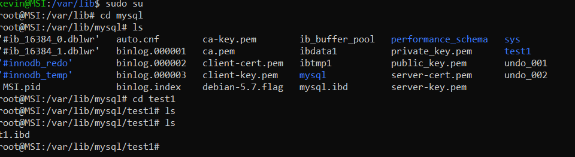

InnoDb

In MySQL 8.4, InnoDB is the default MySQL storage engine. Unless we have configured a different default storage engine, issuing a CREATE TABLE statement without an ENGINE clause creates an InnoDB table.

Features

Supports indexing using B-Trees,allows clustered indexes, data compression and encryption,data caching,foreign key support,FTS indexes,geo-spatial indexes,index caches,transactions,mvcc and has row locking granularity.

Notes:

* Whenever we use a create table statement we are creating a InnoDb table by default.
  Ex:
  CREATE TABLE t1 (a INT, b CHAR (20), PRIMARY KEY (a)) ENGINE=InnoDB;
  We dont have to specify ENGINE=InnoDB; when InnoDB is our default storage engine
* InnoDb tables are created by default in a file-per-table tablespace.
  A file-per-table tablespace contains data and indexes for a single InnoDB table, and is stored on the file system in a single data file.
  This behavior is controlled by the innodb_file_per_table variable. Disabling innodb_file_per_table causes InnoDB to create tables in the system tablespace.
  We can set this using :-> SET GLOBAL innodb_file_per_table=ON
  Whenever we create a table in a database a file-per-table tablespace is created in an .ibd data file in a schema directory under the MySQL data directory. The .ibd file is named for the table (table_name.ibd).
  
  
  This is what happens when I create a table t1 in the database test.

* Advantages of InnoDb file-per-table namespace
   Disk Space Reclamation: Disk space is returned to the operating system when a table in a file-per-table tablespace is truncated or dropped. Shared tablespaces only free space internally.
   Efficient ALTER TABLE: Table-copying ALTER TABLE operations won't necessarily lead to increased disk space usage that isn't released back to the OS, unlike shared tablespaces.
   Faster TRUNCATE TABLE: Truncating tables is generally faster in file-per-table tablespaces.   
   Storage Flexibility: Data files can be placed on separate storage devices for better I/O, space management, and backups.   
   Table Importability: Individual tables can be imported from other MySQL instances.   
   Support for Advanced Row Formats: Supports DYNAMIC and COMPRESSED row formats, which are not available in the system tablespace.
   Improved Data Recovery: Easier and faster recovery in case of data corruption as individual tables are in separate files.   
   Faster Individual Table Backup/Restore: Allows for quick backup and restore of individual tables using MySQL Enterprise Backup without affecting other tables.   
   Easy Table Size Monitoring: Table size can be monitored directly on the file system by checking the size of the tablespace file.   
   Potential Performance Gains on Linux: Can improve performance with innodb_flush_method = O_DIRECT due to how Linux handles concurrent writes to single files.
   Higher Individual Table Size Limit: Each table has its own 64TB size limit, whereas shared tablespaces have a single 64TB limit for all tables within them.

* InnoDb Row Formats:
  The row format of an InnoDB table determines how its rows are physically stored on disk. InnoDB supports four row formats, each with different storage characteristics. Supported row formats include REDUNDANT, COMPACT, DYNAMIC, and COMPRESSED. The DYNAMIC row format is the default.

  The innodb_default_row_format variable defines the default row format.
  Can be set globally like this->
  mysql> SET GLOBAL innodb_default_row_format=DYNAMIC;
  Query OK, 0 rows affected (0.00 sec)
  
  Overview of InnoDb Row Formats
  
  InnoDb row formats define how the data within a table's rows is physically stored on disk. 
  This storage method has a direct impact on:
  Storage Efficiency: How much space each row occupies.
  Performance: The speed of queries and data manipulation operations (DML).
  Resource Usage: The amount of memory (buffer pool) and disk I/O required.
  
  The goal of different row formats is to optimize for various workloads and storage characteristics. More compact storage can lead to more rows fitting on a single disk page, which can improve performance by reducing the number of disk reads needed.
  
  InnoDB, the default storage engine in MySQL, supports four main row formats: REDUNDANT, COMPACT, DYNAMIC, and COMPRESSED.
  
  Brief Comparison of InnoDB Row Formats
  Here's a brief comparison highlighting the key differences between the four InnoDB row formats:
  
  REDUNDANT:
  Provides compatibility with older MySQL versions.
  Stores the first 768 bytes of variable-length columns within the B-tree index node, with the rest on overflow pages.
  Fixed-length columns >= 768 bytes are treated as variable-length and can be stored off-page.
  Generally less storage-efficient compared to newer formats.
  Does not support enhanced variable-length column storage, large index key prefixes, or compression.
  Supported in system, file-per-table, and general tablespaces.
 
  COMPACT:
  Designed to reduce row storage space (approximately 20% less than REDUNDANT).
  Also stores the first 768 bytes of variable-length columns in the index node, with the remainder on overflow pages.
  Increases CPU usage for some operations but can be faster for I/O-bound workloads.
  Does not support enhanced variable-length column storage, large index key prefixes, or compression.
  Supported in system, file-per-table, and general tablespaces.
 
  DYNAMIC:
  Offers the same compact storage characteristics as COMPACT.
  Enhanced Variable-Length Column Storage: Can store long variable-length column values (like VARCHAR, BLOB, TEXT) fully off-page. The index record only contains a 20-byte pointer to the overflow page. This prevents large data values from filling up B-tree nodes.
  Large Index Key Prefix Support: Supports index key prefixes up to 3072 bytes (compared to 767 bytes in REDUNDANT and COMPACT).
  Does not support compression.
  Supported in system, file-per-table, and general tablespaces.
  
  COMPRESSED:
  
  Builds upon the features of the DYNAMIC row format.
  Compression Support: Provides table and index data compression, which can significantly reduce storage space.
  Uses similar off-page storage mechanisms as DYNAMIC.
  The KEY_BLOCK_SIZE option controls how much column data is stored in the clustered index and how much goes to overflow pages.
  Supports large index key prefixes up to 3072 bytes.
  Supported in file-per-table and general tablespaces only (not in the system tablespace).
  
  In summary, newer row formats like DYNAMIC and COMPRESSED offer better storage efficiency and capabilities for handling large data values and indexes compared to the older REDUNDANT and COMPACT formats. The choice of row format depends on the specific needs of your application and data. The default row format in MySQL 8.4 is DYNAMIC.

* InnoDB Primary Keys:
  It's highly recommended to define a primary key for every table.
  Ideal Primary Key Columns: Choose columns that are frequently used in important queries, never blank, always have unique values, and rarely change after insertion.
  Example of Poor Choice: Using (firstname, lastname) as a primary key is generally not good because names can be the same, blank, or change.
  Solution for No Obvious Key: If no suitable existing columns are found, create a new numeric ID column (often using AUTO_INCREMENT) to serve as the primary key or part of it.
  Auto-increment: This feature automatically fills in ascending numeric values as new rows are added.
  Composite Primary Keys: Primary keys can consist of multiple columns. In such cases, an AUTO_INCREMENT column should usually come first.
  Importance for Performance: Primary keys are crucial for database performance and are a key design aspect for large or frequently used tables.
  Performance Tip: Defining a primary key during table creation is much faster than adding it later using ALTER TABLE.

* InnoDB AUTO_INCREMENT Handling:
  InnoDB provides a configurable locking mechanism that can significantly improve scalability and performance of SQL statements that add rows to tables with AUTO_INCREMENT columns. To use the AUTO_INCREMENT mechanism with an InnoDB table, an AUTO_INCREMENT column must be defined as the first or only column of some index such that it is possible to perform the equivalent of an indexed SELECT MAX(ai_col) lookup on the table to obtain the maximum column value. The index is not required to be a PRIMARY KEY or UNIQUE, but to avoid duplicate values in the AUTO_INCREMENT column, those index types are recommended.

  InnoDB AUTO_INCREMENT Lock Modes
  This section describes the AUTO_INCREMENT lock modes used to generate auto-increment values, and how each lock mode affects replication. The auto-increment lock mode is configured at startup(cannot be set once you have started the server) using the innodb_autoinc_lock_mode variable.
  There are three possible settings for the innodb_autoinc_lock_mode variable. The settings are 0, 1, or 2, for “traditional”, “consecutive”, or “interleaved” lock mode, respectively. Interleaved lock mode (innodb_autoinc_lock_mode=2) is the default.

  

* InnoDB Indexes:
  