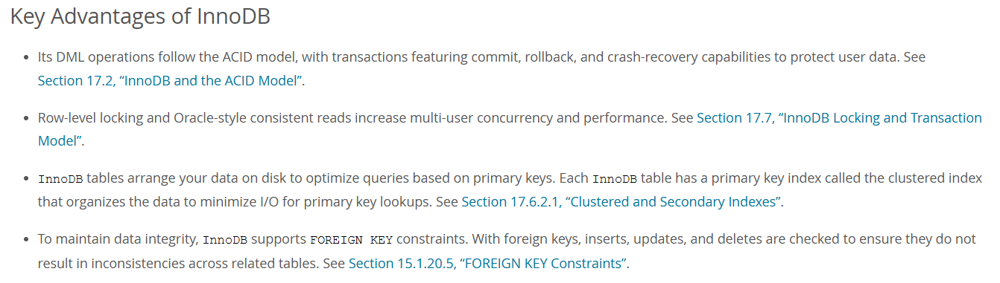

InnoDb

In MySQL 8.4, InnoDB is the default MySQL storage engine. Unless we have configured a different default storage engine, issuing a CREATE TABLE statement without an ENGINE clause creates an InnoDB table.

